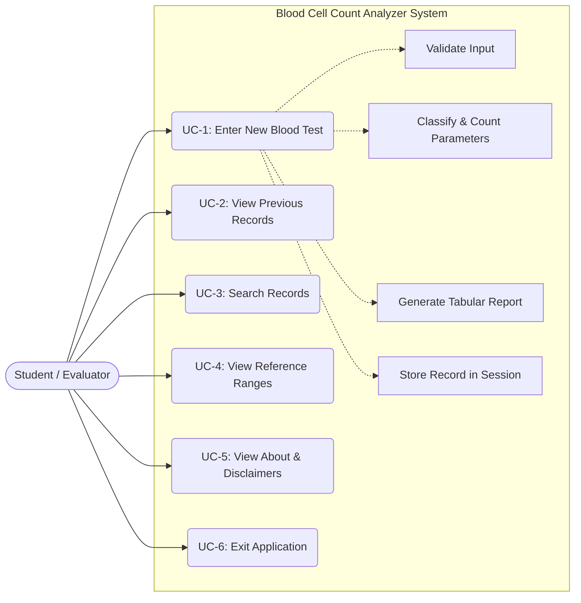
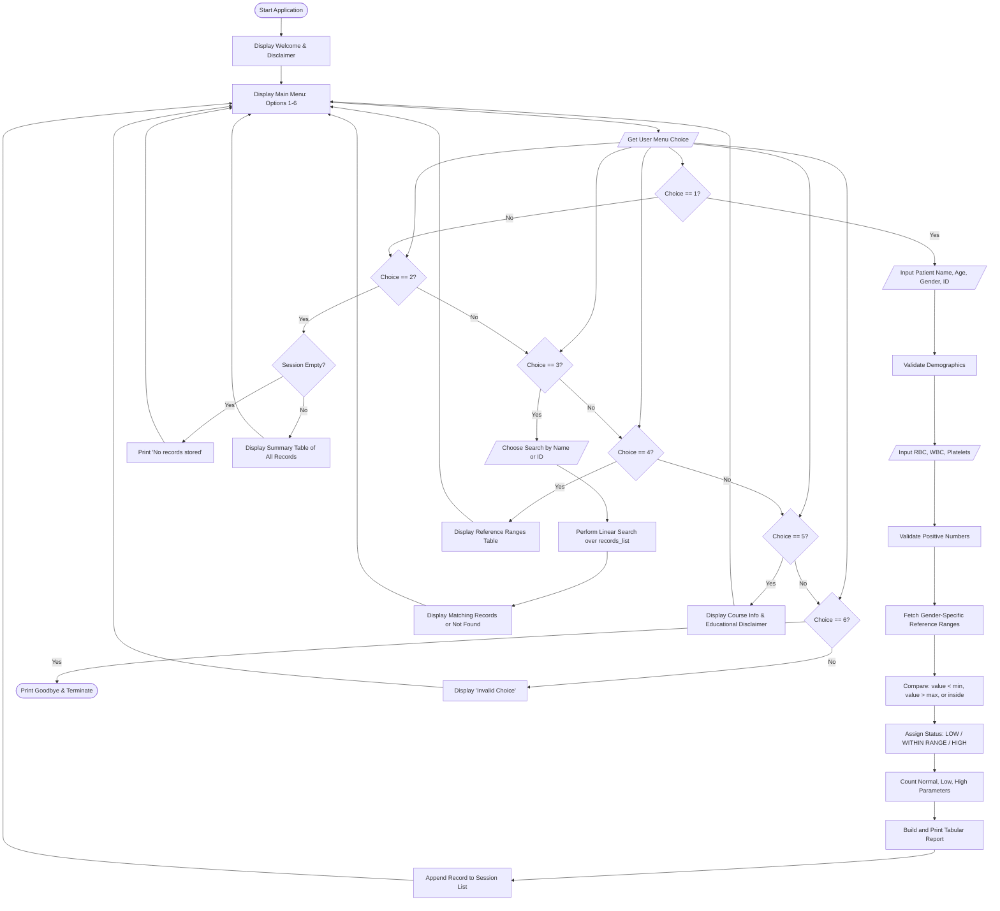

# System Design, Algorithm, and Architecture Documentation

**Project Title:** Blood Cell Count Analyzer  
**Course Code:** CSE1021 – Introduction to Problem Solving and Programming  
**Branch:** B.Tech CSE (Health Informatics)

---

## 1. System Architecture

The software follows a modular, layered console architecture designed for clear separation of concerns:

```
+-----------------------------------------------------------------------+
|                             USER INTERACTION                          |
|                  Console Terminal (CLI Input / Output)                |
+-----------------------------------------------------------------------+
                                  |
                                  v
+-----------------------------------------------------------------------+
|                    MAIN CONTROLLER & MENU (main.py)                   |
|                   Interactive Menu Loop & Option Routing              |
+-----------------------------------------------------------------------+
         |                       |                     |
         v                       v                     v
+-----------------+     +-----------------+   +-------------------------+
| VALIDATION      |     | ANALYSIS ENGINE |   | SESSION RECORDS         |
| (validation.py) |     | (analyzer.py)   |   | (records.py)            |
|                 |     |                 |   |                         |
| - String Check  |     | - Classify      |   | - In-memory list storage|
| - Number Check  |     | - Count totals  |   | - Linear Search by Name |
| - Demographic   |     | - Assign notes  |   | - Linear Search by ID   |
|   Validation    |     |                 |   |                         |
+-----------------+     +-----------------+   +-------------------------+
                                 ^
                                 |
+--------------------------------+--------------------------------------+
| REFERENCE RANGES (reference_ranges.py)                                |
| Centralized baseline dictionary for RBC, WBC, and Platelets           |
+-----------------------------------------------------------------------+
                                 |
                                 v
+-----------------------------------------------------------------------+
| REPORT GENERATION (report.py)                                         |
| Formatted table builder, summary counters, and academic disclaimers   |
+-----------------------------------------------------------------------+
```

---

## 2. Use Case Model

### Actors:
- **Primary Actor:** Student / User / Evaluator
- **System:** Blood Cell Count Analyzer Application

### Use Cases:
1. **UC-1: Enter New Blood Test**
   - User provides Name, Age, Gender, and optional Sample ID.
   - User inputs measured RBC, WBC, and Platelet levels.
   - System validates each input.
   - System evaluates parameters against reference ranges and outputs analysis report.
   - System persists record to active session list.
2. **UC-2: View Previous Records**
   - User requests session history.
   - System displays tabular list of all analyzed records and allows drilling into any record.
3. **UC-3: Search Records**
   - User searches by Patient Name (partial/full) or Sample ID.
   - System executes linear search and displays matching reports.
4. **UC-4: View Reference Ranges**
   - System prints the educational reference table.
5. **UC-5: View About & Disclaimers**
   - System renders project background, Health Informatics rationale, and ethical disclaimers.
6. **UC-6: Exit Program**
   - User terminates program cleanly.

### Mermaid Use Case Diagram:


---

## 3. Workflow & Flowchart

### Complete Application Flowchart (Mermaid):


---

## 4. Algorithms

### Algorithm 1: Numerical Input Validation
```text
Step 1: Loop indefinitely:
Step 2:   Display prompt and read raw string input.
Step 3:   Trim leading and trailing whitespace.
Step 4:   If trimmed string is empty:
            Display "Input cannot be empty".
            Continue loop.
Step 5:   Try converting string to float (or integer).
          If conversion raises ValueError:
            Display "Invalid numerical input".
            Continue loop.
Step 6:   If numerical value <= 0:
            Display "Value must be greater than zero".
            Continue loop.
Step 7:   Return the validated numerical value.
```

### Algorithm 2: Parameter Classification & Aggregation
```text
Step 1: Input: blood_values (RBC, WBC, Platelets), patient_gender.
Step 2: Retrieve gender-specific reference range for RBC from BLOOD_RANGES dictionary.
Step 3: Retrieve standard reference ranges for WBC and Platelets.
Step 4: For each parameter:
          If value < minimum_range:
            Set status = "LOW"
          Else If value > maximum_range:
            Set status = "HIGH"
          Else:
            Set status = "WITHIN RANGE"
Step 5: Initialize counters:
          total = 3, within_range = 0, low = 0, high = 0.
Step 6: For each parameter result in results_list:
          If status == "WITHIN RANGE": increment within_range by 1.
          Else If status == "LOW": increment low by 1.
          Else If status == "HIGH": increment high by 1.
Step 7: Return classified parameters and summary dictionary.
```

### Algorithm 3: Linear Search by Name
```text
Step 1: Input: records_list, search_query.
Step 2: Normalize search_query to lowercase and strip whitespace.
Step 3: Initialize empty list matches = [].
Step 4: For each record in records_list:
          Extract patient_name = record["patient_info"]["name"].lower()
          If search_query is a substring of patient_name:
            Append record to matches.
Step 5: Return matches list.
```

---

## 5. Pseudocode

```text
MODULE ReferenceRanges
    DEFINE DICTIONARY BLOOD_RANGES WITH RANGES FOR RBC, WBC, PLATELETS
END MODULE

FUNCTION ClassifyValue(value, min_val, max_val)
    IF value < min_val THEN
        RETURN "LOW"
    ELSE IF value > max_val THEN
        RETURN "HIGH"
    ELSE
        RETURN "WITHIN RANGE"
    END IF
END FUNCTION

FUNCTION AnalyzeBloodValues(values, gender)
    min_rbc, max_rbc = GetRbcRange(gender)
    min_wbc, max_wbc = GetWbcRange()
    min_plt, max_plt = GetPlateletRange()

    rbc_stat = ClassifyValue(values["RBC"], min_rbc, max_rbc)
    wbc_stat = ClassifyValue(values["WBC"], min_wbc, max_wbc)
    plt_stat = ClassifyValue(values["Platelets"], min_plt, max_plt)

    within_count = 0
    low_count = 0
    high_count = 0

    FOR EACH status IN [rbc_stat, wbc_stat, plt_stat] DO
        IF status == "WITHIN RANGE" THEN
            within_count = within_count + 1
        ELSE IF status == "LOW" THEN
            low_count = low_count + 1
        ELSE IF status == "HIGH" THEN
            high_count = high_count + 1
        END IF
    END FOR

    RETURN PackagedResults(within_count, low_count, high_count)
END FUNCTION

FUNCTION Main()
    records_list = []
    WHILE True DO
        DisplayMenu()
        choice = ReadUserInput()
        
        IF choice == "1" THEN
            patient = GetPatientInfo()
            values = GetBloodValues()
            analysis = AnalyzeBloodValues(values, patient.gender)
            record = CreateRecord(patient, values, analysis)
            DisplayReport(record)
            Append record TO records_list
        ELSE IF choice == "2" THEN
            ViewAllRecords(records_list)
        ELSE IF choice == "3" THEN
            SearchRecords(records_list)
        ELSE IF choice == "4" THEN
            DisplayReferenceRanges()
        ELSE IF choice == "5" THEN
            DisplayAboutAndDisclaimer()
        ELSE IF choice == "6" THEN
            PRINT "Exiting application"
            BREAK
        ELSE
            PRINT "Invalid choice, please re-enter"
        END IF
    END WHILE
END FUNCTION
```

---

## 6. Data Structure Specifications

### 1. In-Memory Session Storage
```python
records_list = [
    {
        "patient_info": {
            "sample_id": "SMP-1001",
            "name": "Rahul Sharma",
            "age": 19,
            "gender": "Male"
        },
        "blood_values": {
            "RBC": 4.8,
            "WBC": 6500.0,
            "Platelets": 220000.0
        },
        "analysis": {
            "parameters": [
                {
                    "parameter": "RBC",
                    "description": "Red Blood Cells",
                    "value": 4.8,
                    "unit": "million cells/mcL",
                    "min": 4.5,
                    "max": 5.9,
                    "range_str": "4.5 - 5.9 million cells/mcL",
                    "status": "WITHIN RANGE",
                    "educational_note": "RBC value is within normal educational limits."
                },
                ...
            ],
            "summary": {
                "total_parameters": 3,
                "within_range": 3,
                "low": 0,
                "high": 0,
                "outside_range": 0
            }
        }
    }
]
```
