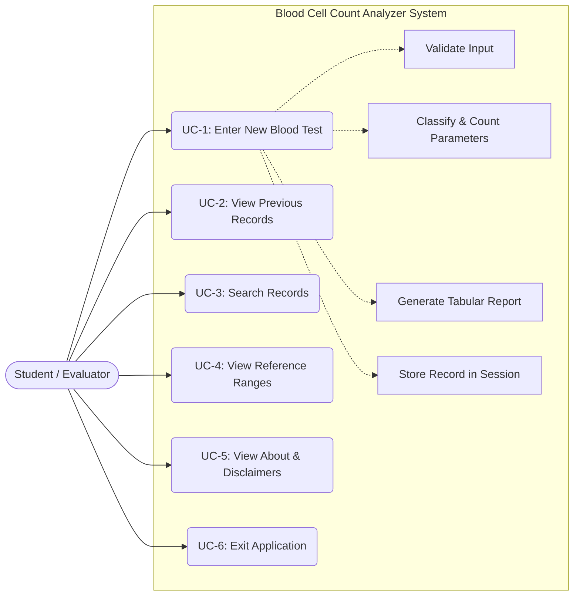
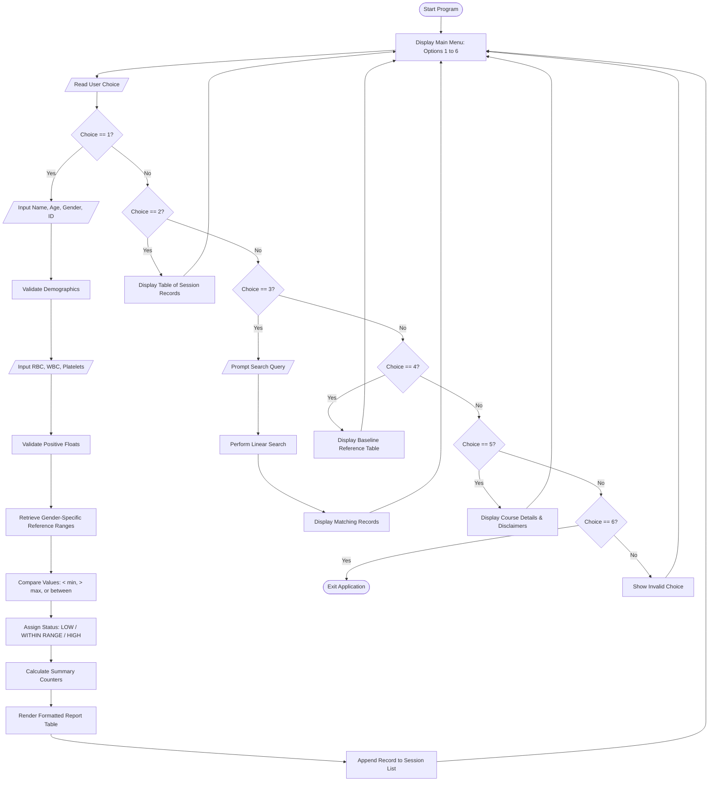
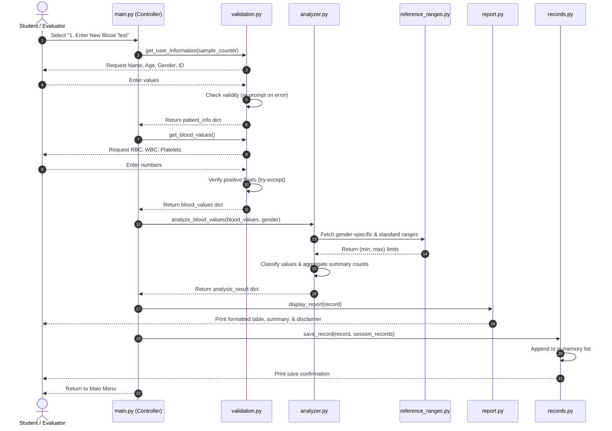
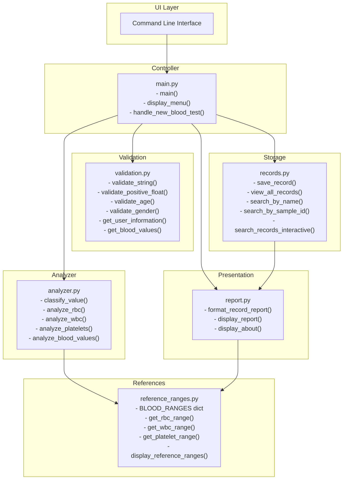
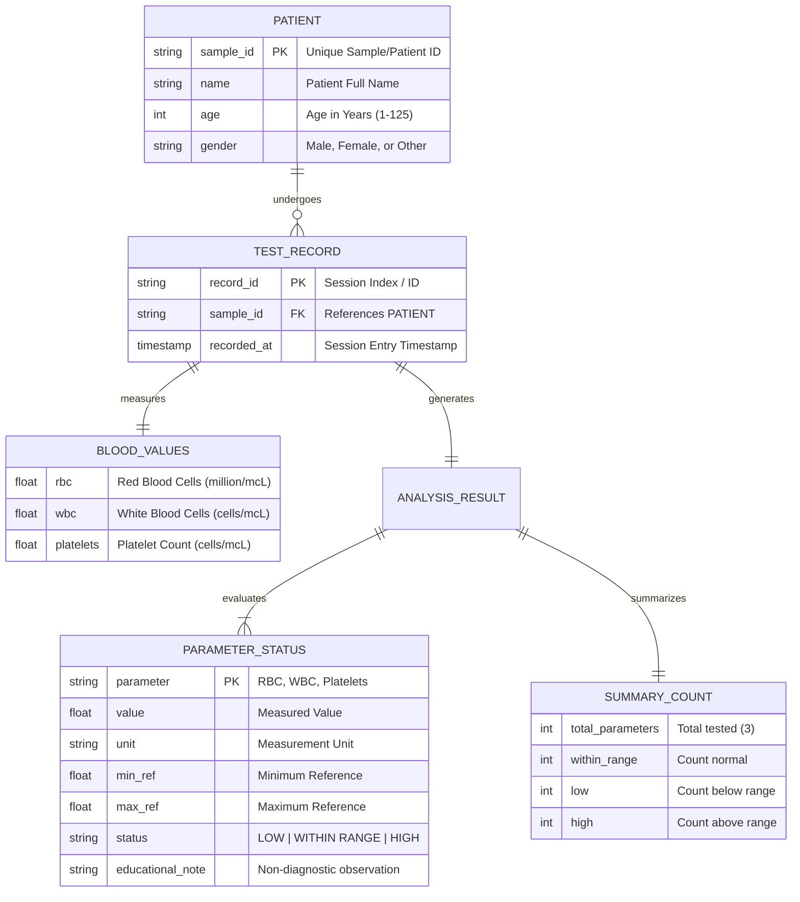

# PROJECT REPORT: BLOOD CELL COUNT ANALYZER
## An Educational Blood Test Data Analysis System

---

### 1. COVER PAGE

**Project Title:** Blood Cell Count Analyzer: An Educational Blood Test Data Analysis System  
**Course Code:** CSE1021 – Introduction to Problem Solving and Programming  
**Degree Program:** Bachelor of Technology (B.Tech) in Computer Science and Engineering  
**Specialization:** Health Informatics  
**Academic Year / Semester:** 2026 / First Year  
**Platform / Portal:** VITyarthi – Build Your Own Project  
**Author / Student Name:** Isha Singh Rajput  
**Submission Date:** September 2026  

---

### 2. INTRODUCTION

The Complete Blood Count (CBC) is among the most ubiquitous diagnostic tests in clinical medicine. It evaluates the cellular composition of human blood, specifically enumerating:
- **Red Blood Cells (RBC):** Oxygen and carbon dioxide transporters.
- **White Blood Cells (WBC):** Key cellular components of the immune defense mechanism.
- **Platelets (Thrombocytes):** Critical cellular fragments that facilitate blood clotting and vascular repair.

In clinical health informatics, transforming raw physiological observations into meaningful, structured, and validated digital records is the foundation of Hospital Information Systems (HIS), Laboratory Information Systems (LIS), and Clinical Decision Support Systems (CDSS).

The **Blood Cell Count Analyzer** is an educational, console-based computational tool designed to simulate this workflow. It captures patient demographics, takes numerical blood count measurements, validates the data to prevent runtime crashes, cross-references measurements against centralized educational reference ranges, categorizes parameters as `LOW`, `WITHIN RANGE`, or `HIGH`, and compiles an easy-to-read tabular report with summary metrics and clear educational notices.

---

### 3. PROBLEM STATEMENT

Manual verification of laboratory hematology values by students or laypersons is subject to multiple challenges:
1. **Human Transcription and Comparison Errors:** Comparing multiple parameters against separate normal intervals (especially when intervals vary by gender, such as RBC) is tedious and error-prone.
2. **Cognitive Overload for Beginners:** Raw laboratory numbers lack immediate contextual meaning for introductory learners without a structured visual comparator.
3. **Misinterpretation and Premature Diagnosis:** Non-clinical individuals frequently jump to alarming conclusions (e.g., self-diagnosing anemia or leukemia) from minor deviations without understanding biological variability.

**Technical Problem:**  
To design and implement a beginner-friendly, modular Python software application using core concepts from CSE1021 that automates laboratory data input, validates input formats, evaluates values against gender-aware reference intervals, aggregates statistical counts, and generates an aligned report accompanied by strict non-diagnostic educational disclaimers.

---

### 4. FUNCTIONAL REQUIREMENTS

The application provides five major functional modules:

1. **Patient Demographic Management (Module 1):**
   - Captures Patient Full Name (validates non-empty string).
   - Captures Patient Age (validates positive integer between 1 and 125).
   - Captures Gender from predefined options: Male, Female, or Other.
   - Assigns an automatic sequential Sample ID (e.g., `SMP-1001`) with optional manual override.

2. **Laboratory Data Input & Sanitization (Module 2):**
   - Prompts for RBC count in million cells/mcL.
   - Prompts for WBC count in cells/mcL.
   - Prompts for Platelet count in cells/mcL.
   - Automatically catches and rejects non-numeric strings, zero, and negative inputs.

3. **Blood Value Analysis & Range Classification (Module 3):**
   - Retrieves gender-specific thresholds for RBC and standard adult thresholds for WBC and Platelets.
   - Classifies each parameter into `LOW`, `WITHIN RANGE`, or `HIGH` using `if-elif-else` structures.
   - Appends specific educational observations for each parameter.
   - Aggregates overall metrics: Total Parameters, Within Range count, Low count, and High count.

4. **Report Generation & Formatting (Module 4):**
   - Generates a formatted text table with aligned columns displaying Parameter, Observed Value, Reference Interval, and Status.
   - Displays summary metrics.
   - Appends mandatory educational disclaimers explaining that this is not a medical diagnosis tool.

5. **Session-Level In-Memory Record Storage & Search (Module 5):**
   - Stores multiple patient test records in a Python list of dictionaries during the session.
   - Displays a summary table of all previous session records.
   - Provides linear search capabilities by Patient Name (partial/case-insensitive) or Sample ID.

---

### 5. NON-FUNCTIONAL REQUIREMENTS

1. **Usability:**  
   The application features an intuitive console interface with informative prompts, clear unit notations (e.g., `in million cells/mcL, e.g., 4.8`), and a continuous 6-option menu loop.
2. **Reliability & Crash Resilience:**  
   The program never crashes due to unexpected user inputs (such as entering letters for numbers, negative values, or blank lines). All exceptions (`ValueError`) are intercepted with `try-except` blocks within `while True` retry loops.
3. **Maintainability:**  
   The codebase is decoupled across 6 specialized Python files. Reference ranges are isolated within a single dictionary (`BLOOD_RANGES` in `reference_ranges.py`), allowing updates without touching the classification engine.
4. **Performance:**  
   Computation, classification, and linear search execute instantaneously ($< 10\text{ ms}$) on standard consumer hardware.
5. **Resource Efficiency:**  
   The project strictly utilizes Python's built-in standard library with no external dependencies (zero third-party pip packages), ensuring minimal CPU and memory footprint ($< 25\text{ MB}$ RAM).
6. **Ethical Safety & Transparency:**  
   Explicit educational notices and disclaimers are presented on startup, within the About page, and at the footer of every generated report.

---

### 6. SYSTEM ARCHITECTURE

The application implements a layered, modular architecture:

```
+-----------------------------------------------------------------------+
|                             USER INTERACTION                          |
|                  Console Terminal (CLI Input / Output)                |
+-----------------------------------------------------------------------+
                                  |
                                  v
+-----------------------------------------------------------------------+
|                    MAIN CONTROLLER & MENU (main.py)                   |
|                   Interactive Menu Loop & Option Routing              |
+-----------------------------------------------------------------------+
         |                       |                     |
         v                       v                     v
+-----------------+     +-----------------+   +-------------------------+
| VALIDATION      |     | ANALYSIS ENGINE |   | SESSION RECORDS         |
| (validation.py) |     | (analyzer.py)   |   | (records.py)            |
|                 |     |                 |   |                         |
| - String Check  |     | - Classify      |   | - In-memory list storage|
| - Number Check  |     | - Count totals  |   | - Linear Search by Name |
| - Demographic   |     | - Assign notes  |   | - Linear Search by ID   |
|   Validation    |     |                 |   |                         |
+-----------------+     +-----------------+   +-------------------------+
                                 ^
                                 |
+--------------------------------+--------------------------------------+
| REFERENCE RANGES (reference_ranges.py)                                |
| Centralized baseline dictionary for RBC, WBC, and Platelets           |
+-----------------------------------------------------------------------+
                                 |
                                 v
+-----------------------------------------------------------------------+
| REPORT GENERATION (report.py)                                         |
| Formatted table builder, summary counters, and academic disclaimers   |
+-----------------------------------------------------------------------+
```

---

### 7. DESIGN DIAGRAMS

#### 7.1 Use Case Diagram


#### 7.2 Workflow / Process Flow Diagram


#### 7.3 Sequence Diagram


#### 7.4 Class / Component Diagram


#### 7.5 Entity-Relationship (ER) & Storage Design


---

### 8. DESIGN DECISIONS & RATIONALE

1. **Why Modular Python Files Instead of a Single Monolithic Script?**  
   Splitting the project across 6 focused files (`main.py`, `validation.py`, `analyzer.py`, `reference_ranges.py`, `report.py`, `records.py`) enforces the **Single Responsibility Principle**. It allows independent unit testing of functions (as shown in `run_tests.py`), simplifies debugging, and demonstrates proper software engineering practices for first-year students.

2. **Why Python Standard Library Only (No External pip Packages)?**  
   For an introductory CSE1021 course, requiring heavy third-party packages (like pandas, numpy, or flask) obscures foundational problem-solving concepts. By using native Python data structures (lists and dictionaries), the code remains transparent, portable, and runnable on any computer without environment configuration issues.

3. **Why In-Memory Storage Rather than a Database?**  
   The syllabus emphasizes list and dictionary manipulation and linear search algorithms. Introducing SQLite or ORMs would add unnecessary complexity outside the course syllabus. An in-memory list of dictionaries perfectly captures the required CRUD/search functionality while highlighting core course topics.

4. **Why Rule-Based Comparison Over Machine Learning?**  
   Standard clinical laboratory reference intervals are deterministic, legally regulated physiological thresholds, not statistical prediction tasks. Rule-based conditional structures (`if-elif-else`) are computationally efficient, fully transparent, 100% explainable, and directly aligned with the CSE1021 syllabus.

5. **Why Explicit Non-Diagnostic Disclaimers?**  
   In Health Informatics, ethical safety is paramount. Labeling a low RBC count as "anemia" is clinically irresponsible, as anemia diagnosis requires clinical history, hemoglobin, hematocrit, and erythrocyte indices. Hence, the system deliberately restricts its outputs to factual educational observations.

---

### 9. IMPLEMENTATION DETAILS

The implementation uses standard Python constructs:
- **`validation.py`**:
  - `validate_string(prompt, min_len=1)`: Strips whitespace and loops until length $\ge 1$.
  - `validate_positive_float(prompt, param_name)`: Encloses `float(raw_val)` inside a `try-except ValueError` block. Checks `if num <= 0` and rejects zero/negative values.
  - `validate_age()`: Verifies integer range $1 \le \text{age} \le 125$.
  - `validate_gender()`: Accepts menu indices `1`, `2`, `3` or keywords `Male`, `Female`, `Other`.
- **`analyzer.py`**:
  - `classify_value(value, min_range, max_range)`: Evaluates mutually exclusive branches using `if-elif-else`.
  - `analyze_blood_values(blood_values, gender)`: Calls parameter analyzers, initializes counter variables to 0, loops through results, and aggregates totals.
- **`records.py`**:
  - `save_record()`: Employs `records_list.append(record)`.
  - `search_by_name()` & `search_by_sample_id()`: Implements linear search algorithms comparing normalized lowercase strings.
- **`report.py`**:
  - Formats tables using fixed-width string formatting (`f"{p['parameter']:<12} | {val_str:<12} | ..."`).

---

### 10. SCREENSHOTS / RESULTS

#### 1. Interactive Menu & Welcome Screen
```text
Welcome to the Blood Cell Count Analyzer!
Designed for CSE1021 - Introduction to Problem Solving and Programming.
Note: This software is strictly for educational purposes.

==================================================
           BLOOD CELL COUNT ANALYZER
   Educational Health Informatics Analysis System
==================================================
1. Enter New Blood Test
2. View Previous Records
3. Search Record
4. View Reference Ranges
5. About / Disclaimer
6. Exit
==================================================
Enter your choice (1-6): 1
```

#### 2. Input Collection & Validation in Action
```text
==================================================
          MODULE 1: PATIENT INFORMATION
==================================================
Enter Patient Full Name: Rahul Sharma
Enter Patient Age (in years, 1-125): 19

Select Gender:
  1. Male
  2. Female
  3. Other / Prefer not to specify
Enter choice (1-3) or type Male/Female/Other: 1
Enter Sample/Patient ID [Press Enter for default: SMP-1001]: 

Patient information recorded successfully.

==================================================
        MODULE 2: BLOOD TEST DATA ENTRY
==================================================
Please enter the measured laboratory values.
Note the standard units specified for each parameter.

1. Enter RBC Count (in million cells/mcL, e.g., 4.8): 4.8
2. Enter WBC Count (in cells/mcL, e.g., 7200): 6500
3. Enter Platelet Count (in cells/mcL, e.g., 250000): 220000

Blood test values recorded successfully.
```

#### 3. Formatted Analysis Report Output
```text
======================================================================
                  BLOOD CELL COUNT ANALYSIS REPORT
              Educational Health Informatics Laboratory
======================================================================
Sample / Patient ID : SMP-1001
Patient Name        : Rahul Sharma
Age                 : 19 years
Gender              : Male
----------------------------------------------------------------------
Parameter    | Value        | Reference Range        | Status
----------------------------------------------------------------------
RBC          | 4.8          | 4.5-5.9                | WITHIN RANGE
WBC          | 6500         | 4500-11000             | WITHIN RANGE
Platelets    | 220000       | 150000-450000          | WITHIN RANGE
----------------------------------------------------------------------
SUMMARY
  Total parameters analyzed : 3
  Within reference range    : 3
  Below reference range     : 0
  Above reference range     : 0
----------------------------------------------------------------------
EDUCATIONAL OBSERVATIONS:
  * RBC (Red Blood Cells): RBC value is within normal educational limits.
  * WBC (White Blood Cells): WBC value is within normal educational limits.
  * Platelets (Platelet Count): Platelet value is within normal educational limits.
----------------------------------------------------------------------
IMPORTANT NOTICE:
This result strictly compares entered numbers against baseline academic
reference ranges. It DOES NOT indicate, confirm, or rule out any medical
condition. Please consult a licensed medical doctor for clinical care.
======================================================================
```

#### 4. Viewing Saved Records & Linear Search
```text
======================================================================
                  PREVIOUS TEST RECORDS (SESSION)
======================================================================
No.  | Sample ID    | Patient Name       | Age/Sex    | Status Summary
----------------------------------------------------------------------
1    | SMP-1001     | Rahul Sharma       | 19/M       | 3 Normal, 0 Low, 0 High
----------------------------------------------------------------------

Search Query: 'Rahul' -> Found 1 matching record(s).
```

---

### 11. TESTING APPROACH

Testing was executed programmatically using an automated test driver (`run_tests.py`) verifying both normal operations and edge boundaries:

| Test ID | Test Scenario | Inputs Tested | Expected Output | Actual Output | Result |
| :--- | :--- | :--- | :--- | :--- | :--- |
| **TC-01** | All values normal | RBC: 5.0 (M), WBC: 7000, Plt: 250000 | RBC, WBC, Plt = `WITHIN RANGE`<br>Normal=3, Low=0, High=0 | Normal=3, Low=0, High=0 | **PASSED (100%)** |
| **TC-02** | Single value below range | RBC: 3.5 (M), WBC: 6500, Plt: 220000 | RBC = `LOW`<br>Normal=2, Low=1, High=0 | Normal=2, Low=1, High=0 | **PASSED (100%)** |
| **TC-03** | Single value above range | RBC: 4.8 (F), WBC: 13500, Plt: 300000 | WBC = `HIGH`<br>Normal=2, Low=0, High=1 | Normal=2, Low=0, High=1 | **PASSED (100%)** |
| **TC-04** | Multiple abnormal values | RBC: 3.8 (M), WBC: 14200, Plt: 110000 | RBC=`LOW`, WBC=`HIGH`, Plt=`LOW`<br>Normal=0, Low=2, High=1 | Normal=0, Low=2, High=1 | **PASSED (100%)** |
| **TC-05** | Boundaries & search verification | Boundary inputs (4.50, 5.90, 4.49, 5.91) & linear search | 4.5 & 5.9 `WITHIN RANGE`, 4.49 `LOW`, 5.91 `HIGH`; linear search matches correct patient | All conditions matched | **PASSED (100%)** |

---

### 12. CHALLENGES FACED

1. **Handling Inconsistent Laboratory Units:**  
   In actual clinical laboratory practice, RBC is reported in $10^6/\mu\text{L}$ (e.g., 4.8), whereas WBC and Platelets are expressed in raw counts per microliter (e.g., 7,500 and 250,000) or thousands ($10^3/\mu\text{L}$).  
   *Resolution:* We standardized on standard clinical SI base units and embedded clear formatting cues in the user prompt (e.g., `(in million cells/mcL, e.g., 4.8)`).

2. **Preventing Premature Application Crashes:**  
   First-time users frequently type letters into numeric fields or leave inputs empty.  
   *Resolution:* Implemented dedicated validation routines using `try-except ValueError` blocks embedded inside `while True` loops, ensuring the program reprompts without terminating.

3. **Gender-Specific Reference Range Resolution:**  
   RBC counts differ significantly between biological sexes due to hormonal influences on erythropoietin.  
   *Resolution:* We designed a nested dictionary hierarchy in `reference_ranges.py` with female, male, and general fallback profiles, dynamically selected during analysis.

4. **Maintaining Non-Diagnostic Ethical Boundaries:**  
   Ensuring that out-of-range parameters are reported neutrally as mathematical comparisons rather than medical conclusions.  
   *Resolution:* Replaced all diagnostic phrases with descriptive statements (e.g., "RBC value is below the selected reference range") and attached explicit educational disclaimers.

---

### 13. LEARNINGS & KEY TAKEAWAYS

- **Problem Decomposition:** Breaking down a biomedical data analysis pipeline into manageable, decoupled sub-problems (sanitization, analysis, aggregation, presentation, storage).
- **Control Flow Mastery:** Practical experience applying `while` loops for defensive input handling and `if-elif-else` constructs for boundary evaluations.
- **Data Structure Selection:** Deepened understanding of when to use lists (ordered, mutable session history) versus dictionaries (structured, key-value entity mapping).
- **Search Algorithm Implementation:** Hands-on realization of linear search algorithm mechanics, including case-insensitive string parsing.
- **Health Informatics Awareness:** Gained appreciation for how digital health tools must balance computational automation with clinical safety and ethical communication.

---

### 14. FUTURE ENHANCEMENTS

1. **Persistent File Storage:** Implement lightweight JSON or CSV serialization to maintain patient records across application restarts.
2. **Graphical User Interface (GUI):** Build a beginner-friendly desktop interface using Python's standard `tkinter` library.
3. **Expanded Hematology Panel:** Include additional routine complete blood count indices, such as Hemoglobin (Hb), Hematocrit (PCV), Mean Corpuscular Volume (MCV), and Differential Leukocyte Counts (Neutrophils, Lymphocytes, Monocytes, Eosinophils, Basophils).
4. **Automated PDF Export:** Integrate standard document generation to enable users to save and print PDF laboratory report cards.
5. **Longitudinal Trend Visualization:** Add graphical plotting (e.g., line charts) tracking a patient's cell counts over successive clinical visits.

---

### 15. REFERENCES

1. Guttag, J. V. (2021). *Introduction to Computation and Programming Using Python: With Application to Understanding Data*. MIT Press.
2. Lutz, M. (2013). *Learning Python: Powerful Object-Oriented Programming* (5th ed.). O'Reilly Media.
3. Shortliffe, E. H., & Cimino, J. J. (Eds.). (2021). *Biomedical Informatics: Computer Applications in Health Care and Biomedicine* (5th ed.). Springer.
4. Pagana, K. D., Pagana, T. J., & Pagana, T. N. (2022). *Mosby's Diagnostic and Laboratory Test Reference* (15th ed.). Elsevier.
5. Python Software Foundation. (2026). *Python 3 Documentation - Built-in Types, Exceptions, and Control Flow*. https://docs.python.org/3/
6. World Health Organization. (2020). *Guidance on Ethics and Governance of Artificial Intelligence for Health*. WHO Guidelines Approved by the Guidelines Review Committee.
