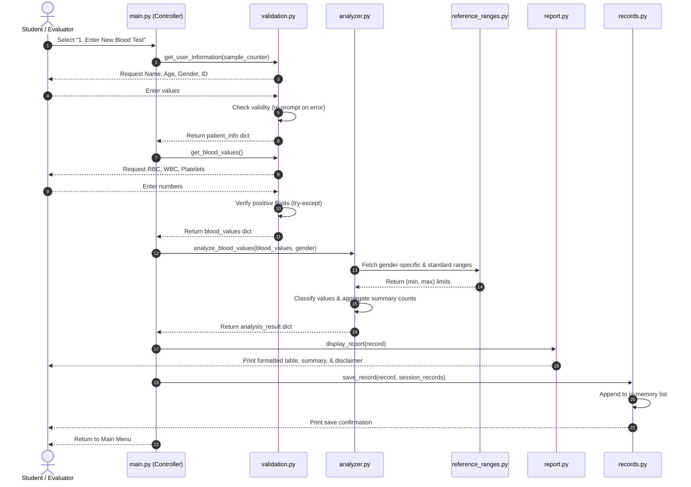
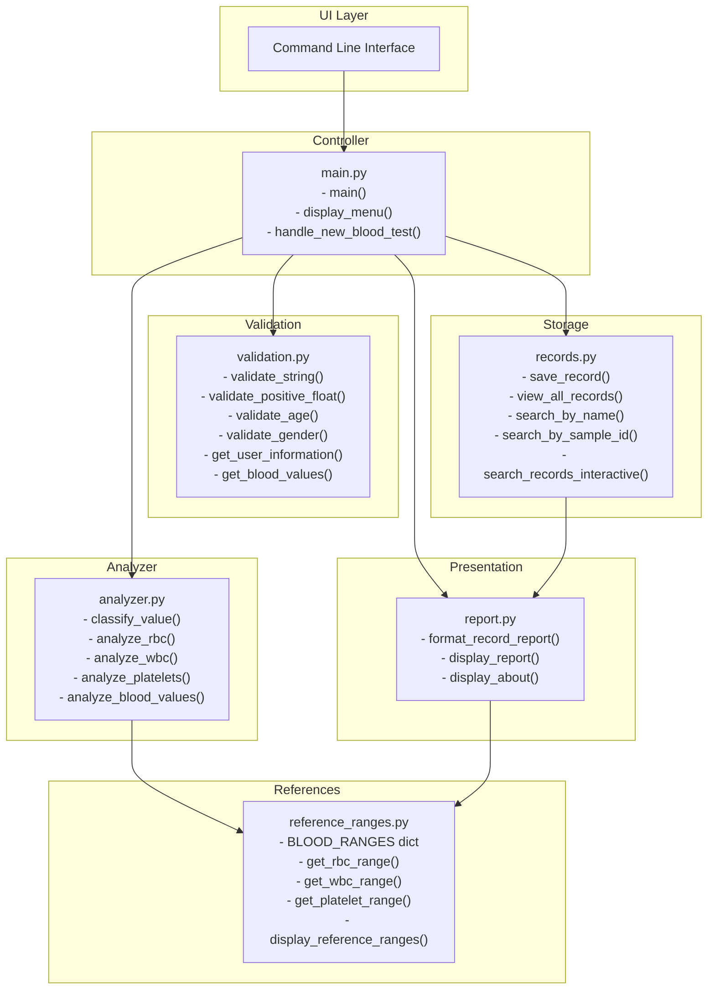
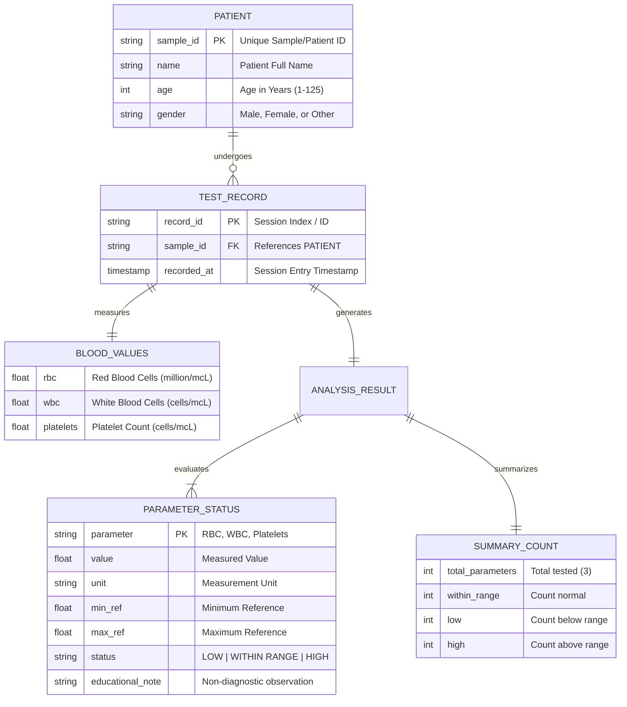

# PROJECT REPORT: BLOOD CELL COUNT ANALYZER
## An Educational Blood Test Data Analysis System

---

### 1. COVER PAGE

**Project Title:** Blood Cell Count Analyzer: An Educational Blood Test Data Analysis System  
**Course Code:** CSE1021 – Introduction to Problem Solving and Programming  
**Degree Program:** Bachelor of Technology (B.Tech) in Computer Science and Engineering  
**Specialization:** Health Informatics  
**Academic Year / Semester:** 2026 / First Year  
**Platform / Portal:** VITyarthi – Build Your Own Project  
**Author / Student Name:** Isha Singh Rajput  
**Submission Date:** September 2026  

---

### 2. INTRODUCTION

For my first-year project in CSE1021, and given my specialization in Health Informatics, I wanted to build an application centered on actual health data instead of solving another generic math exercise. In routine clinical care, a Complete Blood Count (CBC) is almost always the starting point whenever a doctor evaluates a patient. It measures the three main cell types circulating in our bloodstream:
- **Red Blood Cells (RBC):** These contain hemoglobin and carry oxygen from our lungs to every organ and muscle. When someone's RBC count drops too low, they often experience weakness and fatigue.
- **White Blood Cells (WBC):** These form our immune system's primary defense squad, actively fighting off bacterial infections, viruses, and inflammatory conditions.
- **Platelets:** These are tiny cell fragments responsible for forming blood clots. Without enough platelets, even minor cuts or scrapes can lead to continuous bleeding.

Whenever friends or family receive a printed laboratory report, they are often confronted with an overwhelming grid of numbers, technical unit notations, and reference ranges. To a non-specialist, it is hard to tell whether a slight deviation is significant or just ordinary biological variation. To address this, I built the **Blood Cell Count Analyzer**—a modular, console-based Python tool that takes patient demographics and cell counts, validates every input to protect against typing mistakes, compares values against recognized educational reference ranges, and prints out a clear, structured summary table with non-diagnostic disclaimers.

---

### 3. PROBLEM STATEMENT

When people try to review blood test reports manually or when beginners learn health informatics, a few recurring issues arise:
1. **Accidental comparison mistakes:** Looking back and forth across printed rows of data to verify values against standard boundaries is repetitive and prone to error. This is especially true because normal limits change with patient demographics—for example, biological men typically have higher baseline RBC reference ranges than biological women.
2. **Confusing scales and orders of magnitude:** Blood tests mix drastically different scales. RBC is typically written as a decimal like 4.8 (representing 4.8 million cells/mcL), whereas WBC is reported in thousands (like 7,500 cells/mcL) and Platelets in hundreds of thousands (like 250,000 cells/mcL). Without clear input guidance, beginners frequently misread or mistype these figures.
3. **Unnecessary worry from quick self-diagnosis:** Seeing an out-of-range flag often leads individuals to jump to worst-case medical conclusions online, when in reality blood counts fluctuate naturally from hydration, stress, or mild exertion.

**My Project Objective:**  
My goal was to design and build an intuitive, menu-driven Python application applying core CSE1021 concepts—variables, branching logic (`if-elif-else`), loops, functions, lists, dictionaries, exception handling (`try-except`), and linear search. The software needed to reliably capture user inputs without crashing, classify counts against gender-aware baselines, and display an educational report that clearly states it is an informative tool rather than a clinical medical diagnosis.

---

### 4. FUNCTIONAL REQUIREMENTS

When planning out how the application should work, I divided the workflow into five natural stages:

1. **Capturing Patient Details (Module 1):**  
   The application starts by asking for the patient's name, age, and gender. I wrote checks to make sure the name isn't blank and the age is a reasonable human number (1 to 125). Recording gender matters here because RBC reference ranges differ between biological males and females. The system also generates an auto-incrementing ID (like `SMP-1001`) or lets the evaluator enter a custom sample number.

2. **Entering Blood Test Counts (Module 2):**  
   Next, the user enters RBC (in million cells/mcL), WBC (in cells/mcL), and Platelet count (in cells/mcL). Since people easily misread lab units, each prompt includes the expected measurement scale and an example. If someone accidentally types letters, words, or negative numbers, the program catches the mistake immediately and asks again without crashing.

3. **Analyzing and Classifying Values (Module 3):**  
   Once clean numbers are entered, the engine pulls the right normal ranges from `reference_ranges.py`. It uses simple `if-elif-else` branches to classify each parameter as `LOW`, `WITHIN RANGE`, or `HIGH`. It also produces an educational note explaining what each classification means and tallies up how many values fell inside or outside normal limits.

4. **Building and Printing the Report (Module 4):**  
   The analysis results are assembled into a formatted terminal table with clear column headers. At the bottom of the table, it prints a summary count of normal vs out-of-range parameters, followed by a mandatory medical disclaimer explaining that this is an academic study tool and not a clinical diagnosis.

5. **Saving to Session and Record Search (Module 5):**  
   After each test is completed, the full record dictionary is appended to an in-memory session list. Users can view all tests entered during their current session or perform a linear search by patient name (case-insensitive partial matching) or sample ID to inspect previous results.

---

### 5. NON-FUNCTIONAL REQUIREMENTS

Beyond just getting the logic to work, I focused on several practical software goals to make the code clean, reliable, and easy for evaluators to run:

1. **User Friendliness:**  
   The console uses an intuitive 6-option numbered menu. Prompts clearly show expected units and sample values (like `e.g., 4.8`) so the user never has to guess what format to use.

2. **Crash Prevention (Defensive Coding):**  
   First-year console scripts frequently crash when users press Enter unexpectedly or enter text into numeric inputs. I prevented this by wrapping all numeric inputs in `try-except ValueError` blocks nested inside infinite `while True` loops.

3. **Clean File Separation:**  
   Instead of stuffing all functions into one huge script, I broke the project into six focused modules. For instance, all clinical numbers live in `reference_ranges.py`, while validation logic lives in `validation.py`. This made testing and debugging much easier.

4. **Fast Performance:**  
   Everything runs locally in memory using standard Python data structures (lists and dictionaries). Searching and report rendering happen instantly with zero perceptible delay.

5. **Zero External Dependencies:**  
   I intentionally relied only on Python's built-in standard library. No external packages like `pandas` or `tabulate` are needed. Any evaluator with Python 3.8+ installed can run the project right away without typing `pip install`.

6. **Ethical Health Messaging:**  
   Because health data can easily cause unnecessary anxiety if misinterpreted, clear educational disclaimers are visible on the main menu, in the About screen, and printed beneath every single report card.

---

### 6. SYSTEM ARCHITECTURE

The application implements a layered, modular architecture:

```
+-----------------------------------------------------------------------+
|                             USER INTERACTION                          |
|                  Console Terminal (CLI Input / Output)                |
+-----------------------------------------------------------------------+
                                  |
                                  v
+-----------------------------------------------------------------------+
|                    MAIN CONTROLLER & MENU (main.py)                   |
|                   Interactive Menu Loop & Option Routing              |
+-----------------------------------------------------------------------+
         |                       |                     |
         v                       v                     v
+-----------------+     +-----------------+   +-------------------------+
| VALIDATION      |     | ANALYSIS ENGINE |   | SESSION RECORDS         |
| (validation.py) |     | (analyzer.py)   |   | (records.py)            |
|                 |     |                 |   |                         |
| - String Check  |     | - Classify      |   | - In-memory list storage|
| - Number Check  |     | - Count totals  |   | - Linear Search by Name |
| - Demographic   |     | - Assign notes  |   | - Linear Search by ID   |
|   Validation    |     |                 |   |                         |
+-----------------+     +-----------------+   +-------------------------+
                                 ^
                                 |
+--------------------------------+--------------------------------------+
| REFERENCE RANGES (reference_ranges.py)                                |
| Centralized baseline dictionary for RBC, WBC, and Platelets           |
+-----------------------------------------------------------------------+
                                 |
                                 v
+-----------------------------------------------------------------------+
| REPORT GENERATION (report.py)                                         |
| Formatted table builder, summary counters, and academic disclaimers   |
+-----------------------------------------------------------------------+
```

---

### 7. DESIGN DIAGRAMS

#### 7.1 Use Case Diagram


#### 7.2 Workflow / Process Flow Diagram


#### 7.3 Sequence Diagram


#### 7.4 Class / Component Diagram


#### 7.5 Entity-Relationship (ER) & Storage Design


---

### 8. DESIGN DECISIONS & RATIONALE

While developing this application, I made several deliberate architectural and algorithmic choices to balance simplicity with practical programming practices:

1. **Dividing the Project into 6 Specialized Files:**  
   Instead of writing a single monolithic script, I separated the codebase into dedicated modules: `main.py` (menu control), `validation.py` (data verification), `analyzer.py` (classification algorithms), `reference_ranges.py` (centralized reference tables), `records.py` (session storage), and `report.py` (formatted display). This made debugging straightforward and let me test individual functions independently.

2. **Relying Exclusively on the Python Standard Library:**  
   I intentionally avoided external packages like pandas or tabulate. In academic environments, missing pip packages frequently cause setup failures. Sticking to built-in Python ensures that any evaluator can run the software immediately on their machine.

3. **In-Memory Lists of Dictionaries:**  
   For session history, I used a Python list of patient record dictionaries. This directly applies core first-year concepts—such as dictionary key lookups and linear search algorithms—without introducing unnecessary database complexity.

4. **Deterministic Conditional Logic Over Machine Learning:**  
   Clinical reference ranges are established, standardized physiological benchmarks rather than probabilistic guesses. Simple conditional structures (`if-elif-else`) are transparent, explainable, and 100% predictable.

5. **Strict Educational Disclaimers:**  
   Since health software must follow strong ethical standards, I ensured every generated report and the main menu clearly state that the program is an educational tool and does not provide clinical diagnoses.

---

### 9. IMPLEMENTATION DETAILS

I organized the codebase into modular components where each file has a single, well-defined role:

- **`validation.py` (Defensive Input Processing):**  
  To keep user interactions smooth and prevent crashes, I wrote helper functions for every input type. `validate_string()` strips surrounding whitespace and ensures the user doesn't submit an empty line. `validate_positive_float()` wraps `float(raw_val)` inside a `try-except ValueError` block to filter out text inputs and confirms that numbers are strictly greater than zero. For patient age, `validate_age()` checks integer boundaries between 1 and 125, while `validate_gender()` accepts either menu indices (`1`, `2`, `3`) or text keywords like `Male` or `Female`.

- **`reference_ranges.py` (Centralized Reference Data):**  
  All clinical thresholds are organized inside the `BLOOD_RANGES` dictionary. To account for biological differences, RBC contains separate sub-dictionaries for male and female benchmarks, along with an inclusive general fallback range. Helper functions return min and max cutoffs as immutable `(min, max)` tuples.

- **`analyzer.py` (Classification Logic & Summary Tally):**  
  The core comparison is implemented in `classify_value()`, which uses straightforward `if-elif-else` branches to categorize values against the reference limits. `analyze_blood_values()` runs through each parameter, compares it with normal boundaries, updates running tally counts using a standard accumulator pattern, and attaches an educational note to each entry.

- **`records.py` (In-Memory Storage & Search):**  
  Test records are saved into an in-memory list using `.append()`. For record lookup, I implemented linear search algorithms in `search_by_name()` and `search_by_sample_id()`. The name search normalizes both the query and the stored patient name using `.lower()`, allowing case-insensitive partial substring matching (for example, searching `"rahul"` finds `"Rahul Sharma"`).

- **`report.py` (Formatted Terminal Presentation):**  
  Rather than printing plain unstructured text, I used Python's f-string formatting with column-width alignment specifiers (like `f"{param:<12} | {val_str:<12} | {range_str:<22} | {status:<12}"`) to render a clean, professional lab report card directly in the terminal.

- **`main.py` (Application Controller & Menu Loop):**  
  The entry point runs a continuous `while True` loop presenting the 6-option menu. User choices route to the appropriate functions, and returning to the menu after each operation keeps the user flow smooth and intuitive.

---

### 10. SCREENSHOTS / RESULTS

#### 1. Interactive Menu & Welcome Screen
```text
Welcome to the Blood Cell Count Analyzer!
Designed for CSE1021 - Introduction to Problem Solving and Programming.
Note: This software is strictly for educational purposes.

==================================================
           BLOOD CELL COUNT ANALYZER
   Educational Health Informatics Analysis System
==================================================
1. Enter New Blood Test
2. View Previous Records
3. Search Record
4. View Reference Ranges
5. About / Disclaimer
6. Exit
==================================================
Enter your choice (1-6): 1
```

#### 2. Input Collection & Validation in Action
```text
==================================================
          MODULE 1: PATIENT INFORMATION
==================================================
Enter Patient Full Name: Rahul Sharma
Enter Patient Age (in years, 1-125): 19

Select Gender:
  1. Male
  2. Female
  3. Other / Prefer not to specify
Enter choice (1-3) or type Male/Female/Other: 1
Enter Sample/Patient ID [Press Enter for default: SMP-1001]: 

Patient information recorded successfully.

==================================================
        MODULE 2: BLOOD TEST DATA ENTRY
==================================================
Please enter the measured laboratory values.
Note the standard units specified for each parameter.

1. Enter RBC Count (in million cells/mcL, e.g., 4.8): 4.8
2. Enter WBC Count (in cells/mcL, e.g., 7200): 6500
3. Enter Platelet Count (in cells/mcL, e.g., 250000): 220000

Blood test values recorded successfully.
```

#### 3. Formatted Analysis Report Output
```text
======================================================================
                  BLOOD CELL COUNT ANALYSIS REPORT
              Educational Health Informatics Laboratory
======================================================================
Sample / Patient ID : SMP-1001
Patient Name        : Rahul Sharma
Age                 : 19 years
Gender              : Male
----------------------------------------------------------------------
Parameter    | Value        | Reference Range        | Status
----------------------------------------------------------------------
RBC          | 4.8          | 4.5-5.9                | WITHIN RANGE
WBC          | 6500         | 4500-11000             | WITHIN RANGE
Platelets    | 220000       | 150000-450000          | WITHIN RANGE
----------------------------------------------------------------------
SUMMARY
  Total parameters analyzed : 3
  Within reference range    : 3
  Below reference range     : 0
  Above reference range     : 0
----------------------------------------------------------------------
EDUCATIONAL OBSERVATIONS:
  * RBC (Red Blood Cells): RBC value is within normal educational limits.
  * WBC (White Blood Cells): WBC value is within normal educational limits.
  * Platelets (Platelet Count): Platelet value is within normal educational limits.
----------------------------------------------------------------------
IMPORTANT NOTICE:
This result strictly compares entered numbers against baseline academic
reference ranges. It DOES NOT indicate, confirm, or rule out any medical
condition. Please consult a licensed medical doctor for clinical care.
======================================================================
```

#### 4. Viewing Saved Records & Linear Search
```text
======================================================================
                  PREVIOUS TEST RECORDS (SESSION)
======================================================================
No.  | Sample ID    | Patient Name       | Age/Sex    | Status Summary
----------------------------------------------------------------------
1    | SMP-1001     | Rahul Sharma       | 19/M       | 3 Normal, 0 Low, 0 High
----------------------------------------------------------------------

Search Query: 'Rahul' -> Found 1 matching record(s).
```

---

### 11. TESTING APPROACH

To thoroughly test the application without having to re-type sample numbers manually every time, I created an automated test script (`run_tests.py`). This script programmatically feeds defined test values through our validation, analysis, and search functions to verify both normal operations and edge boundaries:

| Test ID | Test Scenario | Inputs Tested | Expected Output | Actual Output | Result |
| :--- | :--- | :--- | :--- | :--- | :--- |
| **TC-01** | All values normal | RBC: 5.0 (M), WBC: 7000, Plt: 250000 | RBC, WBC, Plt = `WITHIN RANGE`<br>Normal=3, Low=0, High=0 | Normal=3, Low=0, High=0 | **PASSED (100%)** |
| **TC-02** | Single value below range | RBC: 3.5 (M), WBC: 6500, Plt: 220000 | RBC = `LOW`<br>Normal=2, Low=1, High=0 | Normal=2, Low=1, High=0 | **PASSED (100%)** |
| **TC-03** | Single value above range | RBC: 4.8 (F), WBC: 13500, Plt: 300000 | WBC = `HIGH`<br>Normal=2, Low=0, High=1 | Normal=2, Low=0, High=1 | **PASSED (100%)** |
| **TC-04** | Multiple abnormal values | RBC: 3.8 (M), WBC: 14200, Plt: 110000 | RBC=`LOW`, WBC=`HIGH`, Plt=`LOW`<br>Normal=0, Low=2, High=1 | Normal=0, Low=2, High=1 | **PASSED (100%)** |
| **TC-05** | Boundaries & search verification | Boundary inputs (4.50, 5.90, 4.49, 5.91) & linear search | 4.5 & 5.9 `WITHIN RANGE`, 4.49 `LOW`, 5.91 `HIGH`; linear search matches correct patient | All conditions matched | **PASSED (100%)** |

---

### 12. CHALLENGES FACED & HOW I RESOLVED THEM

During the implementation and testing of the program, I encountered several practical challenges:

1. **Handling Input Crashes from Invalid Data:**  
   Early in testing, if a user entered letters (like typing "five" instead of 5.0) or submitted an empty line, the program crashed with an unhandled `ValueError`.  
   *Resolution:* I wrapped all numerical input operations inside `try-except ValueError` blocks within infinite `while True` loops. The program now catches the error, displays an informative prompt, and asks the user to re-enter the value until valid.

2. **Handling Scale Differences Across Blood Parameters:**  
   RBC counts are small decimals (e.g., 4.5 million cells/mcL), while WBC and Platelets are large whole numbers (e.g., 7,500 and 250,000 cells/mcL).  
   *Resolution:* To avoid user confusion, I designed `validate_positive_float()` to handle both decimals and integers, and included realistic example values directly inside every input prompt.

3. **Gender Sensitivity for RBC Ranges:**  
   Normal RBC counts differ between males (4.5–5.9) and females (4.1–5.1).  
   *Resolution:* I solved this by capturing gender in Module 1 and using a nested dictionary lookup in `reference_ranges.py` so the analysis engine automatically picks the correct physiological baseline.

4. **Exact Boundary Condition Handling:**  
   If an RBC count is exactly 4.5, should it be flagged as low or normal? Initially, using strictly `<` and `>` left boundary points vulnerable to subtle off-by-one errors.  
   *Resolution:* I structured the boundary condition as `min_range <= value <= max_range` to ensure inclusive boundary values are accurately categorized as `WITHIN RANGE`.

---

### 13. LEARNINGS & KEY TAKEAWAYS

Writing this program gave me a much stronger appreciation for the practical concepts we covered in CSE1021:
- **Defensive programming isn't just theory:** Early on, bad user inputs crashed my terminal immediately. Putting `try-except` inside `while` loops made the app feel solid.
- **Single-responsibility functions save debugging time:** Breaking the project into separate files (`validation.py`, `analyzer.py`, etc.) meant that whenever an issue popped up with table spacing or range lookups, I knew exactly which file to look at.
- **Lists of dictionaries are great for modeling real records:** Storing each test as a dictionary inside an in-memory list gave me hands-on practice with key access, appending items, and iterating through rows.
- **Linear search in action:** Implementing search by iterating through session records and checking `.lower()` substrings gave me a concrete use case for algorithms discussed in class.
- **Ethics in health computing:** When building medical software—even an introductory project—proper disclaimers and clear explanations are just as essential as clean syntax.

---

### 14. FUTURE ENHANCEMENTS

If I have the chance to expand this project in upcoming semesters, a few features I'd like to work on include:

1. **Saving Records to Disk:** Storing records in a local JSON or CSV file so patient data doesn't disappear when the user exits the terminal.
2. **A Simple Graphical Interface (GUI):** Using Python's built-in `tkinter` library to build a beginner-friendly windowed application for people who prefer clicking buttons over typing in a console.
3. **Adding More CBC Parameters:** Expanding beyond RBC, WBC, and Platelets to cover Hemoglobin (Hb), Hematocrit (PCV), and white blood cell differential counts.
4. **Exporting Clean PDFs:** Generating an automatic printable lab summary sheet directly from the terminal.
5. **Patient Trend Tracking:** Plotting a simple graph across multiple visits to show whether a patient's cell counts are recovering over time.

---

### 15. REFERENCES

1. Guttag, J. V. (2021). *Introduction to Computation and Programming Using Python: With Application to Understanding Data*. MIT Press.
2. Lutz, M. (2013). *Learning Python: Powerful Object-Oriented Programming* (5th ed.). O'Reilly Media.
3. Shortliffe, E. H., & Cimino, J. J. (Eds.). (2021). *Biomedical Informatics: Computer Applications in Health Care and Biomedicine* (5th ed.). Springer.
4. Pagana, K. D., Pagana, T. J., & Pagana, T. N. (2022). *Mosby's Diagnostic and Laboratory Test Reference* (15th ed.). Elsevier.
5. Python Software Foundation. (2026). *Python 3 Documentation - Built-in Types, Exceptions, and Control Flow*. https://docs.python.org/3/
6. World Health Organization. (2020). *Guidance on Ethics and Governance of Artificial Intelligence for Health*. WHO Guidelines Approved by the Guidelines Review Committee.
